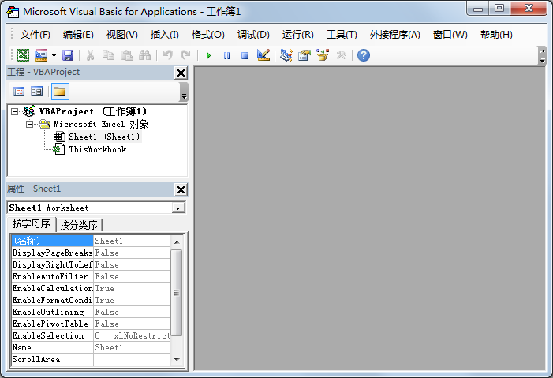

##工作环境
要使用 VBA 进行编程, 首先要使用类似于下面这样的一个窗口, 打开方法很简单, 在 Excel 窗口下按下 `alt+F11` 即可打开这个窗口.  

不用快捷键的方式:  
在 Excel 中点击 `文件` 标签页, 点击 `选项`, 在弹出的窗口中, 点击 `自定义功能区`, 勾选右侧列表的 `开发工具`, 这样 `开发工具` 选项卡就可以显示在 Excel 中了.  
接下来, 我们就可以在 `开发工具` 选项卡中点击 `Visual Basic` 来打开这个编辑窗口.

注: 不同版本的 Office 找到 `开发工具` 的方式不一样, 具体请自行 Google

