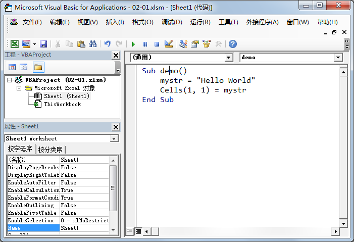

##第一个程序
准备好工作环境之后, 我们来写第一个程序, 来感受一下 VBA 的工作方式.  

新建一个 Excel 文档, 保存为 `Excel 启用宏的工作簿(*.xlsm)`

说明: Excel 默认是保存为 `xlsx` 后缀的文档, 只有选择了 `xlsm` 类型, 我们写下的代码才能被保存在文档中.

####在哪里写代码
按照 [前一节](01.md) 的说明, 打开 VBA 编辑器. 双击左侧的 `Sheet1 (Sheet1)`, 如下图蓝色高亮的部分  


####代码
```
Sub demo()
    mystr = "Hello World"
    Cells(1, 1) = mystr
End Sub
```
把上面的代码粘贴到编辑器右侧的编辑框中, 如下图  



####运行
鼠标点击到第一行, 即 `Sub demo()` 这行, 按 `F5`, 或者点击工具栏上的绿色三角按钮, 或者点击菜单栏 `运行` 的 `运行子过程/用户窗体` 菜单, 都可以运行该程序  

看看效果吧, 不出意外的话, Excel 文档中的第一个单元格应该显示了 `Hello World`

本节的示例文件可以从 [这里](demo/02-01.xlsm) 下载

[上一节](01.md)  <span style="float:right"><a href="03.md">下一节</a></span>

